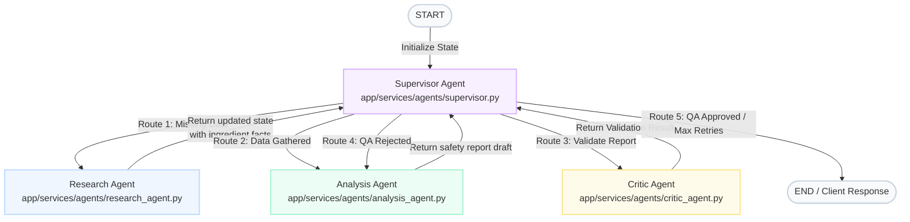

# Cosmet Multi-Agent Safety Analysis Workflow Explainer

This document provides a detailed technical breakdown of how the **Cosmet** cosmetic safety analysis application works under the hood.

---

## 1. High-Level Architecture Overview

Cosmet is designed as a modular web application split into three main layers:

```
┌────────────────────────────────────────────────────────┐
│                   Frontend (Next.js)                   │
│  - User Interface (Dashboard, Register, Login)          │
│  - Real-time WebSocket connection for progress updates │
└──────────────────────────┬─────────────────────────────┘
                           │ HTTP / WebSocket
                           ▼
┌────────────────────────────────────────────────────────┐
│                   Backend (FastAPI)                    │
│  - REST API router endpoints (Auth, Profile, History)  │
│  - LangGraph state orchestrator                        │
└──────────────────────────┬─────────────────────────────┘
                           │
         ┌─────────────────┴─────────────────┐
         ▼                                   ▼
┌──────────────────┐               ┌──────────────────┐
│   Memory Layer   │               │   AI Agentry     │
│  - Redis Server  │               │ - LangGraph      │
│  - In-Memory DB  │               │ - Gemini 3.1     │
│    (Fallback)    │               │   Flash API      │
└──────────────────┘               └──────────────────┘
```

1. **Frontend (Next.js 16 / React 19):** Built as a client-side dashboard utilizing Webpack for compilation. It manages user state, auth tokens, scans ingredient label images via OCR, and displays safety analysis reports.
2. **Backend (FastAPI & Uvicorn):** Hosts HTTP routes and a WebSocket manager. When a safety request is made, it delegates the analysis to the LangGraph Multi-Agent system.
3. **Memory Layer (Redis / RAM Fallback):** Connects to a local/cloud Redis database to persist user profiles, session caches, and historical reports. If no Redis server is available, it gracefully triggers a RAM-based Python dictionary fallback to keep the app functional without data persistence.
4. **AI Layer (LangGraph & Gemini):** Orchestrates four separate AI agents running on the stable **Gemini 3.1 Flash-Lite** model (`gemini-3.1-flash-lite`).

---

## 2. How LangGraph Works & Code Locations

**LangGraph** is a library designed to build stateful, multi-actor applications with LLMs. Unlike simple chains, LangGraph allows modeling agent loops, re-evaluations, and conditional state routing. 

### Core Concepts in Cosmet
* **State Management (Short-Term Memory):** The system passes a centralized `AnalysisState` object (a python `TypedDict`) through the nodes. Every agent receives this dictionary, performs operations, and returns a modified subset of the keys.
* **Nodes:** Each agent or utility represents a node in the graph. In Cosmet, the nodes are:
  - `supervisor` (routes execution)
  - `research` (collects database and internet facts)
  - `analysis` (interprets facts and formats them)
  - `critic` (validates report quality)
* **Edges:** Connections between nodes. Cosmet uses **conditional edges** originating from the `supervisor` to determine which node to activate next, depending on the current graph state.

### Code Directories and Key Files

All LangGraph and Agentic logic is located under the backend services:

* **Graph State definition:** [state.py](file:///Users/shubhamkumar/Desktop/Cosmet/backend/app/services/graph/state.py)
  Defines `AnalysisState` representing the short-term memory schema (e.g., user skin profile, ingredient list, critic feedback, retry counters, and generated markdown).
* **Graph Workflow & Compilation:** [workflow.py](file:///Users/shubhamkumar/Desktop/Cosmet/backend/app/services/graph/workflow.py)
  Uses `StateGraph` to add nodes (`supervisor`, `research`, `analysis`, `critic`), configure edges, set conditional transitions, and call `workflow.compile()` to package the pipeline.
* **Supervisor Agent Node:** [supervisor.py](file:///Users/shubhamkumar/Desktop/Cosmet/backend/app/services/agents/supervisor.py)
  Decides transitions based on the current state.
* **Research Agent Node:** [research_agent.py](file:///Users/shubhamkumar/Desktop/Cosmet/backend/app/services/agents/research_agent.py)
  Runs database queries and fallback Tavily web searches.
* **Analysis Agent Node:** [analysis_agent.py](file:///Users/shubhamkumar/Desktop/Cosmet/backend/app/services/agents/analysis_agent.py)
  Generates reports dynamically via Gemini 3.1 Flash Lite.
* **Critic Agent Node:** [critic_agent.py](file:///Users/shubhamkumar/Desktop/Cosmet/backend/app/services/agents/critic_agent.py)
  Implements strict QA validation filters.

---

## 3. Multi-Agent Agentic Workflow Flowchart

Below is the complete state-routing diagram mapping out the decision logic. Since LangGraph coordinates every transition through the Supervisor, every agent node loops back to the `Supervisor` node after execution:



---

## 4. Agent Capabilities & Core Logic

### The Supervisor Agent (The Orchestrator)
* **Logic:** `route(state: AnalysisState)`
* **Responsibilities:**
  - Evaluates if the research data is gathered (`research_complete`). If not, dispatches to **Research Agent**.
  - Evaluates if the analysis is generated (`analysis_complete`). If not, dispatches to **Analysis Agent**.
  - If analysis is drafted but not yet quality checked, dispatches to **Critic Agent**.
  - Checks if the Critic Agent flagged approvals (`critic_approved`). If so, ends the graph.
  - Monitors retry state (`analysis_attempts >= max_retries`). If the Critic rejects too many times, it terminates the loop and returns a best-effort report to the user instead of hanging.

### The Research Agent (The Fact-Finder)
* **Logic:** `run(state: AnalysisState)`
* **Responsibilities:**
  - **Type Classification:** Checks if ingredients are common chemical names, brand names, or plant botanicals.
  - **Vector Retrieval:** Spawns a semantic Qdrant query using a local `SentenceTransformer('sentence-transformers/all-MiniLM-L6-v2')` model.
  - **Tavily Web Search:** If Qdrant does not yield confident records (score `< 0.7`), it triggers web-searching fallbacks.
  - **Personalized Safety Adjustment:** Calculates customized concerns (e.g. sensitive skin gets score penalties for fragrances; oily skin gets penalties for comedogenic ingredients).

### The Analysis Agent (The Writer)
* **Logic:** `run(state: AnalysisState)`
* **Responsibilities:**
  - Takes raw research properties and user skin parameters from `AnalysisState`.
  - Determines user experience levels (`beginner`, `intermediate`, `expert`).
  - Calls Gemini 3.1 Flash Lite to generate a comprehensive markdown table mapping ingredients, purposes, safety scores, specific concerns, and personalized recommendations.
  - Adds `⚠️ ALLERGEN/INGREDIENT TO AVOID` alerts to matched user allergens.

### The Critic Agent (Quality Assurance)
* **Logic:** `run(state: AnalysisState)`
* **Responsibilities:**
  - Performs structured validations.
  - Runs Gemini 3.1 Flash Lite to review the report against 5 strict rules:
    1. **Completeness:** Are all input ingredients addressed?
    2. **Format:** Is the analysis rendered as a valid markdown table?
    3. **Allergens:** Are all matched allergens flagged as `AVOID`?
    4. **Consistency:** Do safety ratings match the concern descriptions?
    5. **Tone:** Is the language appropriate for the user's expertise level?
  - Returns `APPROVE` or `REJECT`. If rejected, outputs detailed feedback for the Analysis Agent to correct.

---

## 5. Real-Time WebSocket and HTTP Flow

```
User (Browser)               Next.js Frontend               FastAPI Backend
      │                              │                             │
      │── 1. Enter ingredients ─────>│                             │
      │                              │── 2. Create Session ID ────>│
      │                              │<── Establish WebSocket ─────│
      │                              │                             │
      │                              │── 3. POST /analyze ────────>│
      │                              │                             │── [Starts LangGraph]
      │                              │<── 4. WS (Stage: Research) ─│
      │                              │<── 5. WS (Stage: Analysis) ─│
      │                              │<── 6. WS (Stage: Critic) ──│
      │                              │<── 7. WS (Stage: Complete) ─│
      │<── 8. Display Report ────────│                             │
```

1. **Session Establishment:** Before submitting ingredients, the frontend generates a unique session ID and establishes a WebSocket connection to `ws://localhost:8000/api/v1/ws/{session_id}`.
2. **Analysis Trigger:** The frontend sends a POST request containing the ingredients and the session ID.
3. **Async Streaming:** While the backend runs the LangGraph thread, it sends real-time stage updates (`research`, `analysis`, `critic`) to the open WebSocket channel.
4. **UI Update:** The frontend intercepts these packages, updating the progress bar message and percentage.
5. **Finalization:** Once the Critic Agent approves, the backend stores the report in the user's history and returns the payload to the frontend.

---

## 6. Key Fixes Applied to the Application

We applied several critical improvements to ensure stability:

### Frontend
1. **Webpack Compilation (`--webpack`):** Switched Next.js from Turbopack to Webpack. Turbopack crashed in a loop when generating child threads on this macOS terminal, while Webpack builds the bundle perfectly.
2. **Server-Side Rendering (SSR) Hydration Fix:**
   * **Layout Auth Syncing:** Added a `mounted` state inside `DashboardLayout` in [layout.tsx](file:///Users/shubhamkumar/Desktop/Cosmet/frontend/src/app/(dashboard)/layout.tsx) so client-only cookie checks wait until after the initial render. This prevents the server (rendering `null`) and client (rendering the dashboard) from failing React hydration.
   * **Root Tag Warning Suppression:** Added `suppressHydrationWarning` to the `<html>` element in the root [layout.tsx](file:///Users/shubhamkumar/Desktop/Cosmet/frontend/src/app/layout.tsx) to prevent browser extensions and testing tools from triggering console errors.

### Backend
1. **Environment Variables Loading:** Added `load_dotenv()` to [config.py](file:///Users/shubhamkumar/Desktop/Cosmet/backend/app/core/config.py) so variables inside `backend/.env` are correctly loaded into `os.environ` upon startup. This resolved a crash where agents threw `GOOGLE_API_KEY not found in environment`.
2. **Model Deprecation Upgrade:** Upgraded all agent code from the deprecated experimental model `'gemini-2.0-flash-exp'` to the stable, production-ready **Gemini 3.1 Flash Lite** (`'gemini-3.1-flash-lite'`) model.
