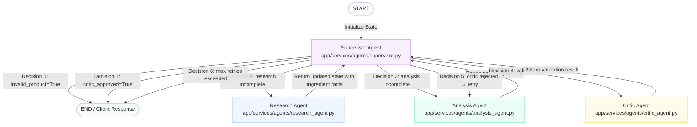

# Cosmet — Multi-Agent Safety Analysis Workflow Explainer

This document provides a detailed technical breakdown of how the **Cosmet** cosmetic safety analysis application works under the hood, reflecting the current production codebase.

---

## 1. High-Level Architecture Overview

Cosmet is a modular web application split into four main layers:

```
┌────────────────────────────────────────────────────────┐
│                   Frontend (Next.js 14)                │
│  - Google OAuth Sign-In (no email/password)            │
│  - JWT tokens stored in localStorage                   │
│  - Real-time WebSocket connection for agent progress   │
└──────────────────────────┬─────────────────────────────┘
                           │ HTTP / WebSocket
                           ▼
┌────────────────────────────────────────────────────────┐
│                   Backend (FastAPI)                    │
│  - REST API routes (Auth, Analysis, Profile, History)  │
│  - LangGraph multi-agent state orchestrator            │
└──────────┬────────────────────────────────┬────────────┘
           │                                │
           ▼                                ▼
┌──────────────────┐              ┌──────────────────────┐
│   Memory Layer   │              │    AI Agent Layer    │
│  - Redis Cloud   │              │  - LangGraph         │
│    (profiles,    │              │  - Gemini 3.1        │
│    history)      │              │    Flash Lite        │
│  - In-memory     │              │  - FastEmbed (ONNX)  │
│    fallback      │              │  - Qdrant Cloud      │
└──────────────────┘              │  - Tavily Search     │
                                  └──────────────────────┘
```

1. **Frontend (Next.js 14 / React):** Client-side app that manages Google OAuth login, stores JWT tokens in `localStorage`, submits ingredients for analysis, and renders the safety report. Auth state is managed by **Zustand** (`authStore`).
2. **Backend (FastAPI & Uvicorn):** Hosts REST endpoints and a WebSocket manager. Delegates analysis requests to the LangGraph multi-agent system.
3. **Memory Layer (Redis Cloud / RAM Fallback):** Persists user profiles (`user:{id}` hash) and analysis history (`user:{name}:history` list) permanently in Redis Cloud. Degrades gracefully to an in-memory Python dict if Redis is unreachable.
4. **AI Layer (LangGraph, Gemini, FastEmbed, Qdrant, Tavily):** Orchestrates four AI agents running on **Gemini 3.1 Flash Lite**. Vector embeddings are generated with **FastEmbed** (ONNX Runtime — no PyTorch).

---

## 2. Authentication Flow (Google OAuth → JWT)

```
Browser                   Next.js               FastAPI Backend        Google
  │                          │                        │                   │
  │── 1. Click Sign In ─────>│                        │                   │
  │                          │── 2. Google GSI SDK ──────────────────────>│
  │                          │<── 3. credential (ID token) ───────────────│
  │                          │── 4. POST /api/v1/auth/google ────────────>│
  │                          │           { credential: "eyJhbGc..." }     │
  │                          │                        │── 5. verify_oauth2_token()
  │                          │                        │   (google-auth lib)
  │                          │                        │── 6. find or create user in Redis
  │                          │                        │── 7. issue JWT access + refresh token
  │                          │<── 8. { access_token, refresh_token, user }│
  │                          │── 9. store tokens in localStorage          │
  │<── 10. redirect /analyze ─│                        │                   │
```

- No bcrypt. No `hashed_password` stored in Redis for Google users.
- JWT tokens are validated on every protected route via `OAuth2PasswordBearer` + `decode_token()` in `deps.py`.
- The Axios client in `api.ts` automatically intercepts 401 responses, attempts a token refresh via `/auth/refresh`, and retries the original request.

---

## 3. Embedding Pipeline (FastEmbed, Not PyTorch)

When ingredients are seeded into Qdrant or looked up at runtime, embeddings are generated with **FastEmbed**:

```python
# generate_embeddings.py & mcp_tools.py
from fastembed import TextEmbedding

model = TextEmbedding(model_name="sentence-transformers/all-MiniLM-L6-v2")
vector = list(model.embed(["Niacinamide"]))[0]  # 384-dimensional float array
```

- **Model**: `sentence-transformers/all-MiniLM-L6-v2` via ONNX Runtime.
- **Vector size**: 384 dimensions.
- **Why FastEmbed instead of `sentence-transformers`?** FastEmbed uses ONNX Runtime for inference — no PyTorch, no GPU libraries. Reduces disk usage by ~1.5 GB and runtime RAM by ~150–200 MB.

---

## 4. LangGraph Multi-Agent Workflow

### State Schema (`AnalysisState`)

The shared `TypedDict` that flows through every agent node:

```python
class AnalysisState(TypedDict):
    # User input
    user_name, skin_type, allergies, expertise_level, ingredient_names

    # Research phase
    research_complete: bool
    ingredient_data: List[Dict]       # raw data per ingredient
    research_confidence: float        # average Qdrant/Tavily confidence

    # Analysis phase
    analysis_complete: bool
    safety_analysis: Optional[str]    # final markdown report

    # Critic phase
    critic_approved: bool
    critic_feedback: Optional[str]
    invalid_product: Optional[bool]   # True → non-cosmetic item detected

    # Retry management
    research_attempts, analysis_attempts, max_retries (default: 5)

    # Observability
    qdrant_hits, tavily_hits, total_critic_rejections
```

### Workflow Graph



---

## 5. Agent Capabilities & Core Logic

### Supervisor Agent — The Orchestrator
**File:** [`supervisor.py`](backend/app/services/agents/supervisor.py)

Routing priority (checked in order):

| Priority | Condition | Action |
|---|---|---|
| **0** | `invalid_product == True` | → `END` immediately (non-cosmetic rejected) |
| **1** | `critic_approved == True` | → `END` (workflow complete) |
| **2** | `research_complete == False` | → `research` agent |
| **3** | `analysis_complete == False` (first time) | → `analysis` agent |
| **4** | `analysis_complete == False` (after critic rejection) | → `analysis` agent (retry with feedback) |
| **5** | `analysis_complete == True`, not yet validated | → `critic` agent |
| **6** | Any agent exceeds `max_retries` (5) | → `END` (best effort) |

---

### Research Agent — The Fact-Finder
**File:** [`research_agent.py`](backend/app/services/agents/research_agent.py)

For each ingredient, the Research Agent runs a two-step lookup:

**Step 1 — Qdrant Vector Search** (`mcp_tools.py → ingredient_lookup`):
```
query_lower = ingredient_name.lower().strip()
db_name_lower = payload["name"].lower().strip()

if query_lower == db_name_lower:
    confidence = 1.0              # Exact match
elif len(query_lower) >= 3 and len(db_name_lower) >= 3
     and (query_lower in db_name_lower or db_name_lower in query_lower):
    confidence = max(score, 0.85) # Substring match (min 3 chars both sides)
```

**Step 2 — Tavily Fallback** (when `confidence < 0.7`):
```python
web_data = tools.tavily_search(ingredient_name)
# Only replace Qdrant result if Tavily has higher confidence
if web_data["confidence"] > confidence:
    data = web_data
```

Confidence counters (`qdrant_hits`, `tavily_hits`) are tracked for the final stats display.

---

### Analysis Agent — The Writer
**File:** [`analysis_agent.py`](backend/app/services/agents/analysis_agent.py)

Takes all ingredient research data + user profile from state and calls **Gemini 3.1 Flash Lite** to generate a structured markdown safety report. The prompt adapts language complexity based on `expertise_level`:
- **Beginner**: simple, jargon-free explanations.
- **Intermediate**: moderate technical detail.
- **Expert**: full mechanism and chemistry references.

Allergen matches are highlighted with `⚠️ ALLERGEN/INGREDIENT TO AVOID` in the report table.

---

### Critic Agent — Quality Assurance
**File:** [`critic_agent.py`](backend/app/services/agents/critic_agent.py)

Runs 6 validation gates via a Gemini 3.1 Flash Lite prompt:

| Gate | Check |
|---|---|
| **1. Completeness** | All submitted ingredients addressed in the report? |
| **2. Format** | Analysis rendered as a valid markdown table with all columns? |
| **3. Allergen Match** | Ingredients matching user allergens flagged as AVOID? |
| **4. Consistency** | Safety scores (1–10) match the concern descriptions? |
| **5. Tone** | Language appropriate for the user's expertise level? |
| **6. Product Relevance** | Do ingredients indicate a cosmetic product? |

**Three possible decisions:**

```
APPROVE           → sets critic_approved=True, workflow ends
REJECT: IMPROVE   → sends detailed feedback to Analysis Agent for retry
REJECT: NON_COSMETIC → sets invalid_product=True, Supervisor routes to END immediately
```

The `NON_COSMETIC` check is evaluated **first** in the parsing logic, before checking for `APPROVE`.

---

### Safety Scorer — Personalized Risk Calculator
**File:** [`mcp_tools.py → safety_scorer`](backend/app/services/tools/mcp_tools.py)

Calculates a personalized 1–10 safety score from base ingredient data + user profile:

```python
is_allergen, _ = self.is_allergen_match(ingredient_name, user_allergies)
# ↑ Always unpack the tuple — the bare tuple would evaluate True even when (False, None)

if is_allergen:
    previous_score = personalized_score
    personalized_score = 10  # Maximum concern
    adjustments.append(f"Allergen match: +{round(personalized_score - previous_score, 1)} points")

if skin_type == "sensitive" and irritation keywords in concerns:
    personalized_score = min(10, personalized_score + 2)

if skin_type == "oily" and "comedogenic" in concerns:
    personalized_score = min(10, personalized_score + 1)
```

Recommendation thresholds:
- Score ≥ 8 → `AVOID`
- Score ≥ 5 → `USE WITH CAUTION`
- Score < 5 → `SAFE`

---

## 6. Real-Time WebSocket & HTTP Flow

```
User (Browser)          Next.js Frontend           FastAPI Backend
      │                        │                          │
      │── 1. Enter ingredients ─>│                          │
      │                        │── 2. POST /api/v1/analyze ─>│
      │                        │       { ingredients, skin_type, ... }
      │                        │                          │── [Starts LangGraph]
      │                        │<── 3. WS: Stage: Research ──│
      │                        │<── 4. WS: Stage: Analysis ──│
      │                        │<── 5. WS: Stage: Critic ────│
      │                        │<── 6. WS: Stage: Complete ──│
      │<── 7. Display Report ───│                          │
      │                        │                          │── 8. Save to Redis history
```

1. Frontend `POST /analyze` triggers `run_analysis()` in `workflow.py`.
2. The LangGraph graph is invoked with an `AnalysisState`.
3. Each agent transition emits a WebSocket message to the session channel.
4. On completion (Critic APPROVE), the result is saved to `user:{name}:history` in Redis.
5. The final `safety_analysis` markdown string is returned to the frontend.

---

## 7. Memory Architecture

### Short-Term Memory (Session Duration)
Managed by `SessionManager` in `session.py`. Lives in Redis with a TTL, tracking the active agent conversation for a single analysis run.

### Long-Term Memory (Persistent)
Managed by `RedisClient` in `redis_client.py`:

| Redis Key Pattern | Data | Type |
|---|---|---|
| `user:{user_id}` | Full user profile hash | Redis Hash |
| `user_email:{email}` | Maps email → user_id | Redis String |
| `user:{user_name}:history` | List of past analysis JSONs | Redis List (`lpush`) |

The history list stores up to 100 entries per user (newest first). If Redis is unreachable, an in-memory Python dict fallback prevents crashes — but data is lost on server restart.

---

## 8. Key Design Decisions

| Decision | Rationale |
|---|---|
| **FastEmbed over `sentence-transformers`** | Eliminates PyTorch (~1.5 GB). Same model, same 384-dim vectors, via ONNX Runtime. |
| **Google OAuth only, no email/password** | Removes entire bcrypt/registration surface. Simpler, more secure. |
| **Confidence threshold 0.7 for Tavily fallback** | Balances local DB hits vs. web search cost. Exact/substring matches boosted to 1.0/0.85 prevent unnecessary Tavily calls. |
| **`invalid_product` as Decision 0 in Supervisor** | Prevents infinite retry loops if the Critic detects non-cosmetic content. Terminates immediately, no Analysis retries. |
| **`is_allergen_match` always unpacked as tuple** | The function returns `(bool, str|None)`. Using it raw as a boolean condition would evaluate to `True` for any non-empty tuple — even `(False, None)`. |
| **`len(query) >= 3` and `len(db_name) >= 3` for substring match** | Prevents false positive confidence boosts for single-letter or two-letter inputs matching nearly every ingredient name. |
| **Next.js `output: "standalone"`** | Reduces production build size from ~1 GB to ~39 MB for faster Vercel deploys. |
